# ZJU-blockchain-course-2025-p1p1pan-Easybet

⬆ 可以️修改成你自己的项目名。

> 第二次作业要求（以下内容提交时可以删除）：
> 
> 进阶的去中心化彩票系统，参与方包括：竞猜玩家、公证人
>
> **背景**：传统的体育彩票系统（例如我国的体育彩票）一般没有彩票交易功能：例如，对于“NBA本赛季MVP为某球员/F1的赛季总冠军为某车队”这类持续时间长的事件的下注一般在赛季开始前就会买定离手，这使得一旦出现突发或不确定事件（如球员A赛季报销/球队B买入强力球星/C车队车手受伤等），很多玩家的选择便会立即失去意义，导致彩票游戏的可玩性下降。因此，一个有趣的探索方向是让彩票系统拥有合规、方便的交易功能。
>
> 建立一个进阶的去中心化彩票系统（可以是体育彩票，或其它任何比赛节目的竞猜，例如《中国好声音》《我是歌手》年度总冠军等，可以参考 [Polymarket](https://polymarket.com/) ），在网站中：
> - 公证人（你自己）可以创立许多竞猜项目：例如某场比赛的输赢、年度总冠军的得主等，每个项目应当有2个或多个可能的选项，一定的彩票总金额（由公证人提供），以及规定好的结果公布时间。
> - 玩家首先领取到测试所需以太币。在网站中，对于一个竞猜项目和多个可能的选项：
>   1. 每个竞彩玩家都可以选择其中的某个选项并购买一定金额（自己定义）的彩票，购买后该玩家会获得一张对应的彩票凭证（一个 ERC721 合约中的 Token）
>   2. 在竞彩结果公布之前，任何玩家之间可以买卖他们的彩票，以应对项目进行期间的任何突发状况。具体的买卖机制如下：一个玩家可以以指定的金额挂单出售（ERC721 Delegate）自己的彩票，其它玩家如果觉得该彩票有利可图就可以买入他的彩票。双方完成一次 ERC721 Token 交易。
>   3. 公证人可以在时间截止时（简单起见，你可以随时终止项目）输入竞猜的结果并进行结算。所有胜利的玩家可以平分奖池中的金额。
> - Bonus（最多5分，若想要完成，可以直接将功能整合进上述要求中）：
>   1. （2分）发行一个 ERC20 合约，允许用户领取 ERC20 积分，并使用ERC20积分完成上述流程。
>   2. （3分）对交易彩票的过程实现一个简单的链上订单簿：卖方用户可以以不同价格出售一种彩票，网页上显示当前订单簿的信息（多少价格有多少该彩票正在出售）。其他用户可以根据最优价格购买彩票。
> - 可以对上述需求进行合理更改和说明。请大家专注于功能实现，网站UI美观程度不纳入评分标准，能让用户能够舒适操作即可。

**以下内容为作业仓库的README.md中需要描述的内容。请根据自己的需要进行修改并提交。**

作业提交方式为：**提交视频文件**和**仓库的链接**到指定邮箱。

## 如何运行

1. 在本地启动ganache应用。

2. 在 `./contracts` 中安装需要的依赖，运行如下的命令：
    ```bash
    npm install
    ```
3. 在 `./contracts` 中编译合约，运行如下的命令：
    ```bash
    npx hardhat compile
    ```
4. 将合约部署到本地 Ganache 网络，运行如下的命令：
   ```bash
   npx hardhat run scripts/deploy.ts --network ganache
    ```
5. 部署成功后，复制 EasyBet 合约的地址(它会显示 "EasyBet deployed to 0x...")。复制到`./frontend/.env.local`文件中的`VITE_CONTRACT_ADDRESS=`
6. 在 `./frontend` 中安装需要的依赖，运行如下的命令：
    ```bash
    npm install
    ```
7. 在 `./frontend` 中启动前端程序，运行如下的命令：
    ```bash
    npm run dev
    ```
8. 在浏览器中打开应用，并确保你的 MetaMask 钱包连接到本地 Ganache 网络。

## 功能实现分析

本项目完整实现了作业要求中的所有核心功能以及两项 Bonus 功能。

1. 多角色系统：公证人 (Admin):页面会通过检查用户地址是否为合约的owner，从而实现前端的权限控制。
              竞猜玩家 (Player): 任何连接钱包的用户都可以作为玩家参与。
2. ERC20 积分系统：项目发行了一个名为 BetToken (BET) 的 ERC20 合约。
   用户可以在网站导航栏 App.vue 中点击 "领取积分" 来调用 claimBetTokens 获取测试积分。
    所有的核心功能，包括创建活动初始奖池、玩家下注、交易彩票，均使用 BET 积分进行结算。
3. 核心竞猜流程：
   创建活动:公证人填写活动描述、多个选项、截止时间和初始奖池金额，创建活动。
   玩家下注：玩家在"竞猜活动页面"浏览活动，选择选项并输入 BET 金额，购买彩票。合约会为玩家铸造一张LotteryTicket(ERC721)作为凭证，该Token ID中记录了活动ID、选项ID和购买金额。
   结束活动：公证人除了可以设置活动的截止下注时间之外还可以手动提前停止活动下注。
   结算活动：公证人在"结算活动" 界面中为已结束的活动选择一个获胜选项，进行结算。
   领取奖励：玩家在"我的彩票"界面中查看持有的彩票。如果活动已结算且玩家中奖，可以点击 "领取奖励"来按比例瓜分总奖池。
4. 彩票交易市场：
   挂单出售：玩家可以在"我的彩票"界面中为尚未结算的彩票点击 "挂单出售"。
   市场浏览与购买："交易市场" 标签页会获取所有活动（可筛选）中正在出售的彩票列表（即订单簿），并展示其价格、选项等信息。其他玩家可以点击 "购买" 来完成彩票和积分的原子交换。


## 项目运行截图

注:所有按钮点击完之后都会出现MetaMask的与区块链的交易请求，这里因为都是类似的，而且视频里也会体现所以就不一一放出来了。
1.  **首页 & 领取积分**
    * 首页，显示连接钱包按钮。点击后会连接上Metamask钱包的地址
    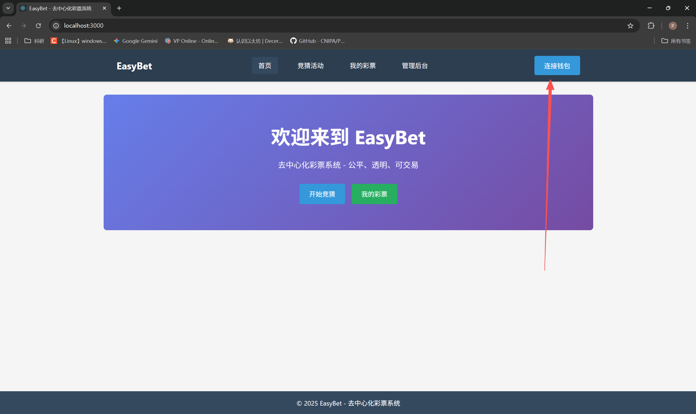
    * 连接钱包后，在导航栏领取 BET 测试积分，点击领取积分后，会跳出MetaMask的与区块链的交易请求。
    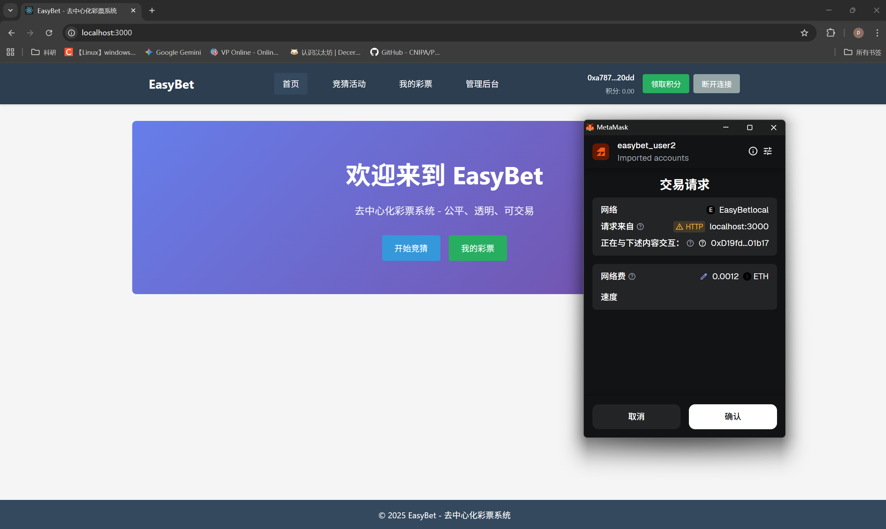
2.  **公证人 - 创建活动**
    * 在 "管理后台" 页面填写活动详情并创建。
    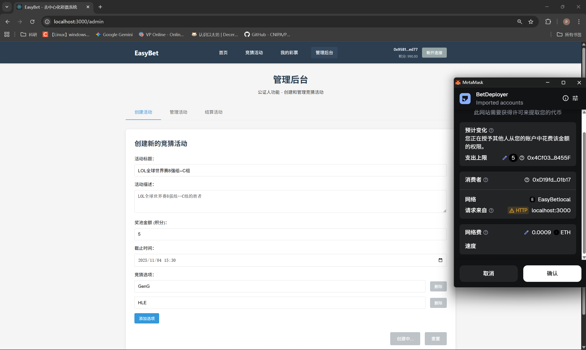
3.  **玩家 - 购买彩票**
    * 在 "竞猜活动" 页面看到新创建的活动，并点击购买。
    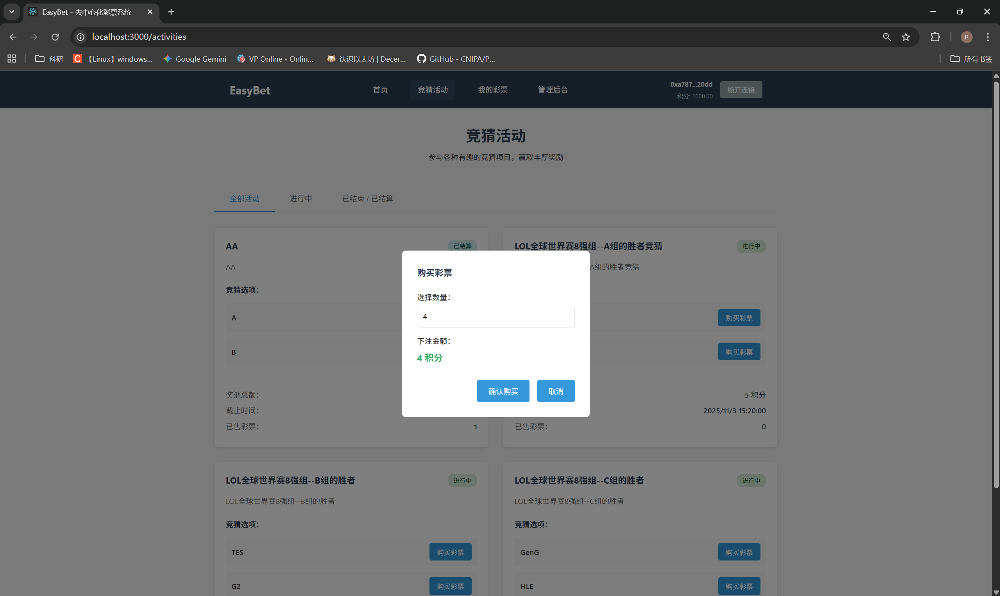
4.  **玩家 - 挂单出售**
    * 在 "我的彩票" 页面查看刚买到的彩票，并进行挂单。
    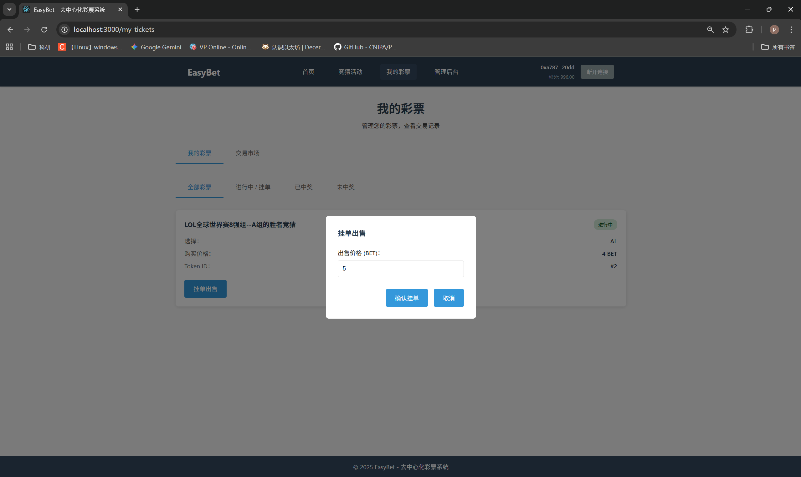
    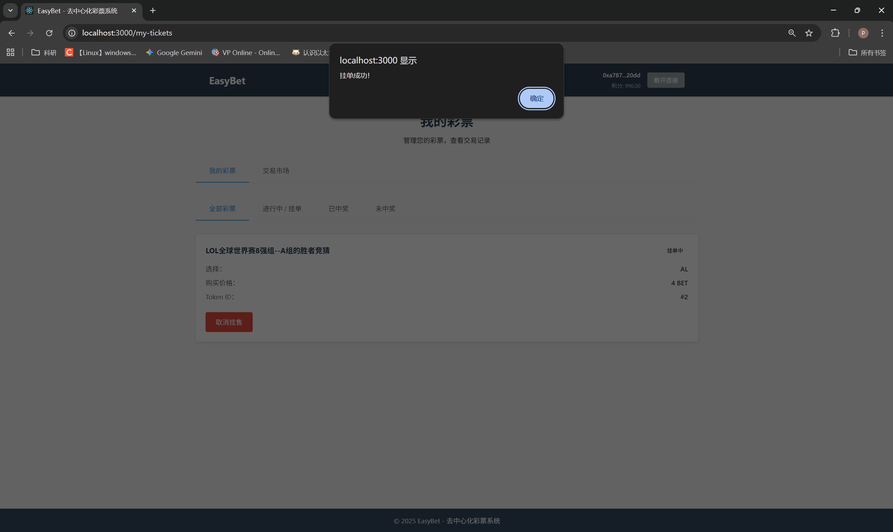
5. **玩家 - 交易市场**
    * 在 "交易市场" image.png标签页，可以看到所有正在出售的彩票。
    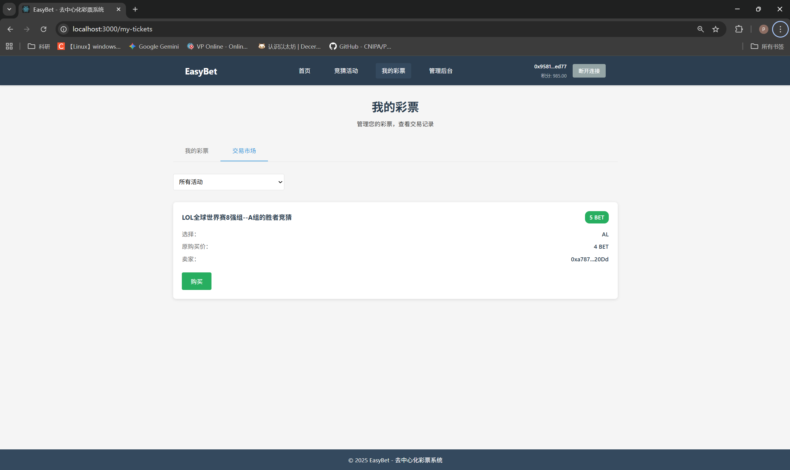
6.  **公证人 - 结束活动**
    * 在 "管理后台" 的 "结束活动" 标签页，将活动提前结束下注。
    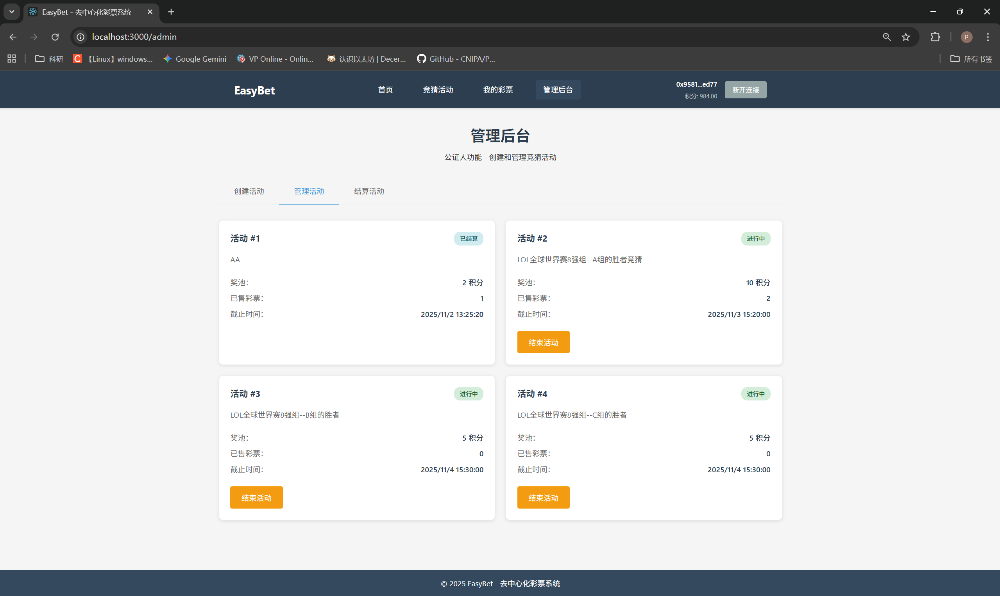
    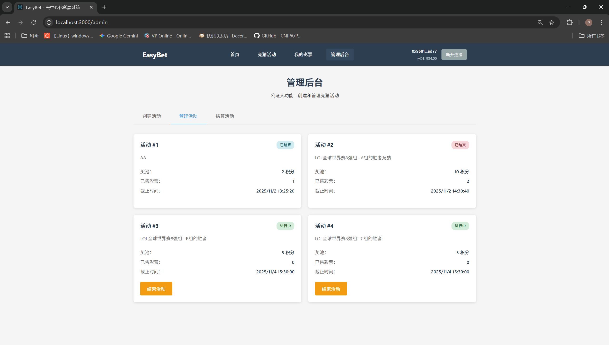
7.  **公证人 - 结算活动**
    * 在 "管理后台" 的 "结算活动" 标签页，为已结束的活动选择获胜者。
    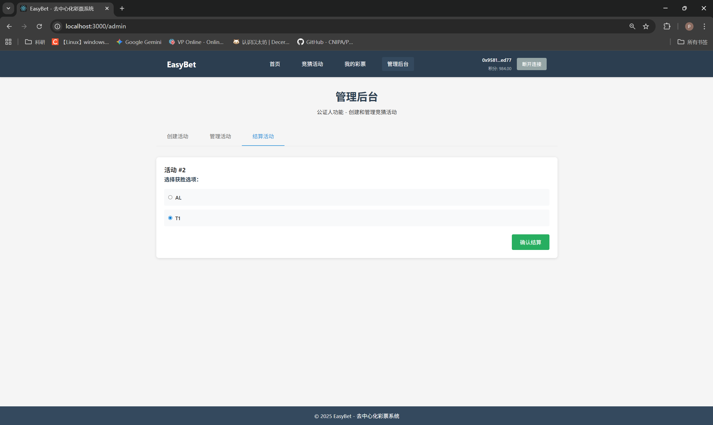
8.  **玩家 - 领取奖励**
    * 中奖玩家在 "我的彩票" 页面看到状态变为 "中奖"，并可以领取奖励。
    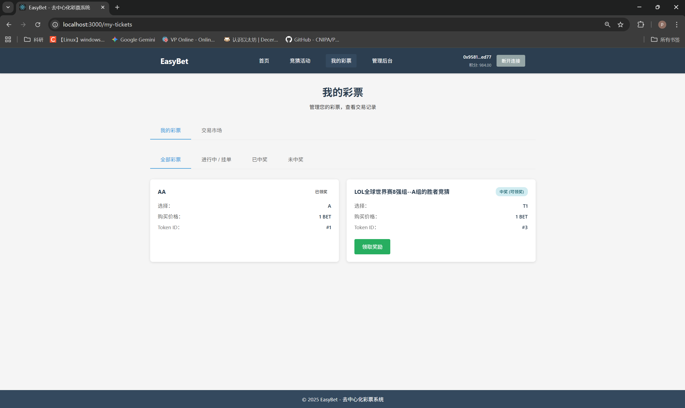
## 参考内容

- 课程的参考Demo见：[DEMOs](https://github.com/LBruyne/blockchain-course-demos)。

- 快速实现 ERC721 和 ERC20：[模版](https://wizard.openzeppelin.com/#erc20)。记得安装相关依赖 ``"@openzeppelin/contracts": "^5.0.0"``。

- 如何实现ETH和ERC20的兑换？ [参考讲解](https://www.wtf.academy/en/docs/solidity-103/DEX/)

